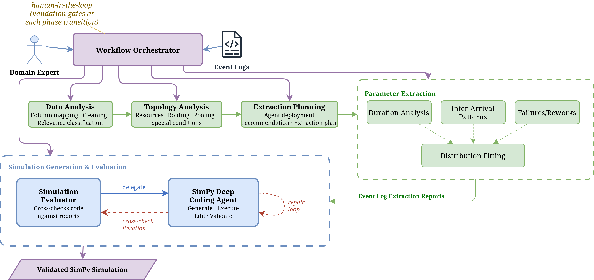

# Run Info
In agent.py line 404, set base_url to your local ollama server URL (default: http://localhost:11434).
Things to watch for:
- user_context is available from respective directory
- Python version is NOT 3.14. This will cause a crash in the SimPy code agent. Use 3.11–3.13.

Start experiment with the following command:
python experiment.py -d data/fischertechnik_lab_A/block-A.csv -n 1 -m qwen3.6:27b-bf16 --context-file data/fischertechnik_lab_A/user_context.md
python experiment.py -d data/fischertechnik_lab_B/block-B.csv -n 1 -m qwen3.6:27b-bf16 --context-file data/fischertechnik_lab_B/user_context.md
python experiment.py -d data/fischertechnik_lab_C/block-C.csv -n 1 -m qwen3.6:27b-bf16 --context-file data/fischertechnik_lab_C/user_context.md

# GenAI4SimPy — Deep Agents

> **Automatically generate executable [SimPy](https://simpy.readthedocs.io/) discrete-event simulation models from manufacturing event logs using a multi-agent LLM pipeline.**

---

## Overview

`genai4simpy-deepagents` orchestrates three specialised AI agents that take a raw production event log (CSV) and — through data analysis, parameter extraction, and code generation — produce a validated, runnable SimPy simulation.

The system is built on the **[DeepAgents](https://github.com/RaikoPipe/deepagents)** framework for hierarchical agent orchestration and **LangGraph** for the SimPy code-generation workflow. All inference runs locally via **Ollama** (default model: `qwen3.5:27b`).

---

## Architecture

### Multi-Agent Pipeline



A **Workflow Orchestrator** drives the pipeline under human-in-the-loop supervision, with a **Domain Expert** validating results at each phase transition:

1. **Data Analysis** — column mapping, cleaning, and relevance classification of the raw event log
2. **Topology Analysis** — resources, routing, pooling, and special conditions
3. **Extraction Planning** — recommends agent deployment and builds the extraction plan
4. **Parameter Extraction** — duration analysis, inter-arrival patterns, and failures/reworks feed into distribution fitting
5. **Simulation Generation & Evaluation** — the **SimPy Deep Coding Agent** generates, executes, edits, and validates the simulation in a repair loop, while the **Simulation Evaluator** cross-checks the resulting code against the extraction reports before iterating again

The result is a **validated SimPy simulation**. Each sub-agent has **role-based report access** — it can only read the reports it needs and write the report it owns — and the orchestrator checks for existing reports on startup, **skipping completed phases** to allow interrupted runs to resume.

### SimPy Code Agent Workflow (LangGraph)


The code agent runs an iterative generate → validate → repair loop (max 5 iterations):

| Node | Description |
|---|---|
| `knowledge_retrieval` | Fetches relevant SimPy docs from embedded Chroma vectorstore |
| `reasoning_step` | Analyses the manufacturing system structure |
| `code_generation` | Generates initial SimPy code from parameters |
| `determine_editing_steps` | Plans structured `str_replace` edits on existing code |
| `code_editing` | Applies planned edits |
| `code_validation` | Executes the code in a subprocess; routes to repair on failure |

---

## Features

- **End-to-end automation** — from raw CSV to validated simulation code
- **Phase resumption** — skip already-completed analysis phases
- **Statistical distribution fitting** — tests 7 scipy distributions and picks the best fit (KS test)
- **Embedded SimPy knowledge** — API reference always loaded; examples/guides retrieved via semantic search
- **Self-hosted LLM** — runs fully locally via Ollama (no API keys required)
- **Role-based agent access control** — prevents agents from accessing or overwriting irrelevant reports
- **Structured code editing** — LLM produces `str_replace` diffs rather than full rewrites

---

## Project Structure

```
genai4simpy-deepagents/
├── agent.py                            # Entry point — orchestrator setup
├── pyproject.toml
├── langgraph.json                      # LangServe deployment config
├── simpy_code_agent_workflow.png       # Workflow diagram
│
├── data/
│   └── production_data/
│       └── Production_Data.csv         # Input event log
│
├── reports/                            # Agent outputs (auto-generated)
│   ├── column_mapping_report.md
│   └── parameter_extraction_report.md
│
└── src/
    ├── genai4simpy_agent/
    │   ├── prompts.py                  # System instructions for all agents
    │   └── tools.py                   # Report read/write/check tools
    │
    ├── data_extraction_tools/
    │   └── tools.py                   # Dataset exploration & statistics tools
    │
    └── simpy_code_workflow/
        ├── graph.py                   # LangGraph code-generation workflow
        ├── tool.py                    # Tool wrapper for orchestrator
        ├── prompts/                   # Prompt files (Markdown)
        ├── context_engineering/       # Vectorstore + SimPy docs
        └── data_models/
            └── simple_model.py        # Pydantic schemas for simulation config
```

---

## Requirements

- Python **3.11+**
- [Ollama](https://ollama.com/) running locally with `qwen3.5:27b` pulled

```bash
ollama pull qwen3.5:27b
```

---

## Installation

```bash
git clone <repo-url>
cd genai4simpy-deepagents

# Standard install
pip install -e .

# With dev tools (mypy, ruff, pytest)
pip install -e ".[dev]"
```

---

## Usage

### Run the full pipeline

```bash
python agent.py
```

The pipeline will:
1. Convert `data/production_data/Production_Data.csv` → `data/eventlog.parquet`
2. Check for existing phase reports and skip completed phases
3. **Phase 1** — Analyse the dataset, detect column roles, ask for user confirmation, write `reports/column_mapping_report.md`
4. **Phase 2** — Extract processing times, inter-arrival distributions, routing patterns, write `reports/parameter_extraction_report.md`
5. **Phase 3** — Generate, validate, and repair a SimPy simulation and return the code

### Deploy via LangServe

```bash
langgraph up
```

Exposes two endpoints:
- `http://localhost:8000/agent/` — Full orchestrator
- `http://localhost:8000/simpy_code_agent/` — SimPy code agent only

---

## Configuration

| Location | Parameter | Description |
|---|---|---|
| `agent.py` | `model="qwen3.5:27b"` | Ollama model for orchestration |
| `agent.py` | `base_url="http://localhost:11434"` | Ollama server URL |
| `agent.py` | `max_output_tokens=64000` | Token budget for code generation |
| `graph.py` | `max_iterations = 5` | Max code repair loop iterations |
| `tools.py` | `REPORTS_DIR = "reports"` | Output directory for phase reports |

---

## How It Works — In Detail

### Phase 1: Data Analysis

The data-analysis sub-agent uses a set of inspection tools to:
- Summarise dataset shape, dtypes, missing values, and duplicates
- Heuristically classify columns as timestamps, case IDs, resource identifiers, product types, or durations
- Output a structured column-mapping report which the user confirms before Phase 2 begins

### Phase 2: Parameter Extraction

The extraction sub-agent reads the confirmed column mapping and:
- Computes **processing times** per resource (mean, std, percentiles)
- Computes **inter-arrival times** per job type (coefficient of variation, mean IAT)
- **Fits statistical distributions** (normal, exponential, lognormal, gamma, Weibull, uniform, triangular) using the KS test and selects the best fit
- Identifies routing patterns and system structure

### Phase 3: SimPy Code Generation

The LangGraph workflow:
1. Retrieves relevant SimPy documentation from an embedded vectorstore (HuggingFace `all-MiniLM-L6-v2` + Chroma)
2. Reasons about the manufacturing system structure
3. Generates initial code using the extracted parameters
4. Validates the code by executing it in a subprocess
5. On failure, plans structured `str_replace` edits and re-validates (up to 5 attempts)

---

## Tech Stack

| Category | Library |
|---|---|
| Agent orchestration | `deepagents`, `langchain`, `langgraph` |
| LLM backend | `langchain-ollama` (Qwen 3.5 27B) |
| Data processing | `pandas`, `numpy`, `scipy` |
| Vector search | `chromadb`, `sentence-transformers` |
| Data validation | `pydantic` |
| Logging | `loguru` |
| Linting | `ruff` |

---

## License

MIT — see [LICENSE](LICENSE).

---

## Author

Richard Reider — richard@reider.io

---

## Model Output Contract

You generate a single, self-contained, importable Python module. It MUST expose
exactly the following interface and MUST NOT execute simulation work on import
(guard any demo run behind `if __name__ == '__main__':`).

### Required module symbols

1. `run_single_replication(seed: int) -> pandas.DataFrame`
   - Seeds BOTH `random.seed(seed)` and `np.random.seed(seed)` as the first
     action, so replications are reproducible and statistically independent.
   - Returns ONE standard event log per call (schema below).
   - Returns a DataFrame (a `(DataFrame, ...)` tuple is also accepted; element 0
     is used). No file I/O, no printing, no global mutation across calls.

2. `RESOURCE_CAPACITIES: dict[str, int]`
   - Maps each CONCRETE resource name (e.g. `vgr_1`, not the pool `vgr_pool`) to
     its capacity. Resource pools are expanded to their individual machines.

3. `SIMULATION_TIME: int`
   - Default horizon in seconds. The harness overrides this to the ground-truth
     observation window, so read this constant wherever you bound the run
     (`env.run(until=SIMULATION_TIME)`); do not hard-code the number elsewhere.

### Standard event-log schema (exact column names)

One row per executed activity instance. On a failure that is reworked, emit
TWO rows: the failed attempt (`failure`) then the successful retry (`success`).

| column                 | type     | semantics                                   |
|------------------------|----------|---------------------------------------------|
| `case_id`              | hashable | workpiece / case id                         |
| `variant`              | str      | variant label; MUST match a GT variant key  |
| `activity`             | str      | activity name; MUST match a GT activity key |
| `resource`             | str      | concrete resource that executed the step    |
| `time:timestamp`       | float    | execution start, sim-seconds from 0         |
| `operation_end_time`   | float    | execution end,   sim-seconds from 0         |
| `lifecycle:state`      | str      | `'success'` or `'failure'` only             |
| `response_status_code` | int      | optional (e.g. 200 / 418 / 401)             |

### Hard rules

- Time is numeric seconds relative to sim start = 0 (NOT datetimes).
- `operation_end_time >= time:timestamp` for every row.
- `variant` and `activity` string values MUST be drawn from the same vocabulary
  as the ground-truth file (`variant_distribution` / `activity_mean_durations_s`
  keys). Mismatched labels silently zero out JSD / MAPE — never invent names.
- Do not emit lifecycle rows other than the executed-instance rows above
  (no separate `scheduled` / `start` rows); the log is one row per execution.
- Module must import cleanly with only: `simpy`, `numpy`, `pandas`, `random`,
  and stdlib.

### Self-check before returning the model

- [ ] `run_single_replication(1)` and `run_single_replication(2)` return
      DataFrames with all 7 required columns and differing content.
- [ ] No NaN in `time:timestamp` / `operation_end_time` / `lifecycle:state`.
- [ ] Every `resource` value appears as a key in `RESOURCE_CAPACITIES`.
- [ ] Every `variant` / `activity` value matches the ground-truth vocabulary.